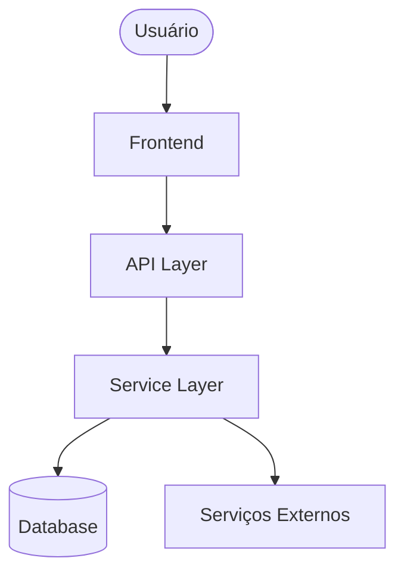
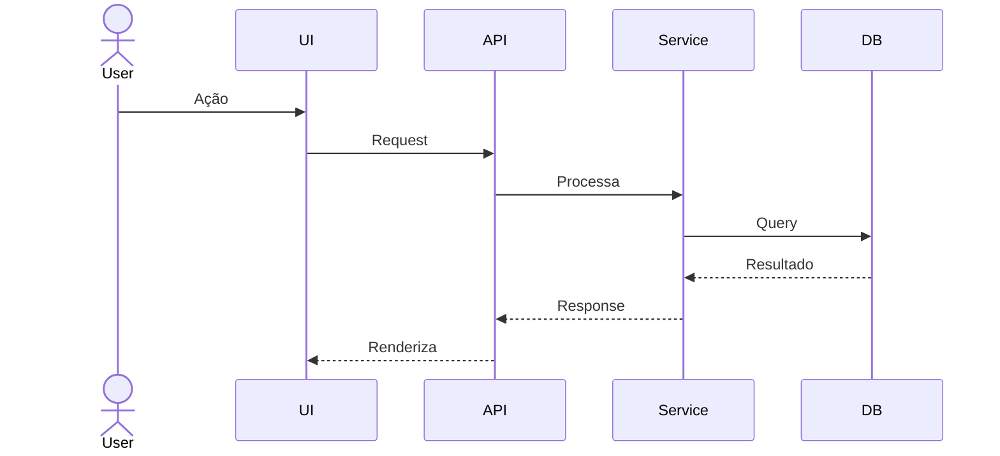
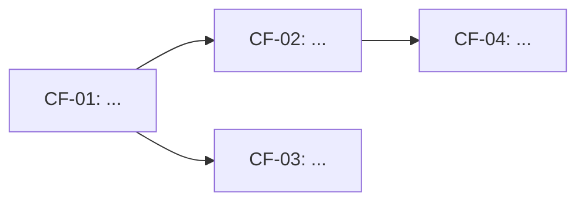

# Fase 2 — CORE FLOW: Decomposição em Módulos

Você está na **Fase 2: CORE FLOW**. O Epic foi aprovado. Agora decomponha o sistema em fluxos lógicos e mapeie a arquitetura de implementação.

---

## Regras desta Fase

- **Leia o `epic.md` antes de tudo** — todo Core Flow deriva do Epic aprovado
- Identifique entre **3 e 8 fluxos** (menos = granularidade insuficiente, mais = excesso de complexidade)
- Para cada fluxo, defina: o que faz, quem usa, componentes envolvidos, dependências
- Gere um **diagrama Mermaid** para o fluxo principal e para arquitetura geral
- Identifique claramente as **dependências entre fluxos** (o que deve vir antes)

---

## Estrutura de Decomposição

### 1. Fluxos do Usuário (User Flows)
Mapeie a jornada do usuário pelos principais cenários:
- Happy path (caminho ideal)
- Caminhos alternativos
- Estados de erro e recuperação

### 2. Módulos do Sistema
Para cada fluxo, identifique os módulos:

| Camada | O que considerar |
|--------|-----------------|
| **Frontend/UI** | Telas, componentes, estados |
| **BFF/API Gateway** | Roteamento, autenticação, rate limiting |
| **Backend/Services** | Lógica de negócio, regras, validações |
| **Data Layer** | Modelos, queries, migrations |
| **Integrações** | APIs externas, webhooks, eventos |
| **Infra** | Jobs, queues, cache, storage |

### 3. Dependências entre Fluxos
Mapeie quais fluxos bloqueiam outros:
```
[Fluxo A] → depende de → [Fluxo B]
[Fluxo C] → paralelo com → [Fluxo D]
```

---

## Diagramas Mermaid

### Diagrama de Arquitetura Geral


### Diagrama de Fluxo por Módulo


---

## Output: `docs/planning/[epic-slug]/core-flow.md`

```markdown
# Core Flow: [Nome do Epic]

> **Baseado em:** [link para epic.md] | **Data:** YYYY-MM-DD

## Visão Geral da Arquitetura

[Diagrama Mermaid da arquitetura geral]

## Fluxos

### CF-01: [Nome do Fluxo]
**Descrição:** O que esse fluxo faz e por quê existe  
**Usuários:** Quem aciona esse fluxo  
**Pré-condições:** O que precisa existir antes

**Componentes envolvidos:**
- Frontend: ...
- API: ...
- Service: ...
- DB: ...
- Integrações: ...

**Diagrama:**
[Mermaid do fluxo]

**Edge cases & regras de negócio:**
- ...

**Dependências:** [CF-XX, CF-XX]

---

### CF-02: [Nome do Fluxo]
...

---

## Mapa de Dependências



## Ordem de Implementação Sugerida

| Ordem | Fluxo | Motivo |
|-------|-------|--------|
| 1     | CF-01 | Base do sistema, sem dependências |
| 2     | CF-02 | Depende de CF-01 |
| ...   | ...   | ... |

---
*Gerado por PLANNER — Fase 2/3*
```

---

Após gerar o arquivo, pergunte:
> _"O Core Flow cobre todos os cenários do Epic? A ordem de implementação faz sentido? Podemos gerar os tickets?"_
