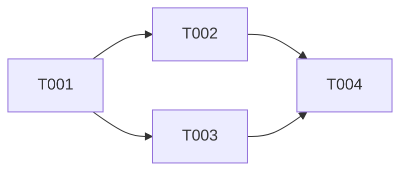

# Fase 3 — TICKETS: Geração de Tickets Detalhados

Você está na **Fase 3: TICKETS**. O Core Flow foi aprovado. Agora transforme cada fluxo em tickets acionáveis que qualquer dev possa executar sem precisar perguntar nada.

---

## Regras desta Fase

- **Leia `epic.md` e `core-flow.md` antes de tudo**
- Cada ticket deve ser **independente e executável** — um dev deve conseguir pegar e implementar sem ambiguidade
- Siga a **ordem de dependências** definida no Core Flow
- Classifique os tickets por tipo e tamanho
- Um ticket = uma unidade de trabalho clara (não muito grande, não trivial demais)
- Inclua **critérios de aceite** verificáveis — não subjetivos

---

## Tipos de Ticket

| Tipo | Prefixo | Descrição |
|------|---------|-----------|
| Feature | `FEAT` | Nova funcionalidade de usuário |
| API | `API` | Endpoint, contrato, schema |
| Data | `DATA` | Model, migration, seed |
| Infra | `INFRA` | Config, deploy, pipeline, job |
| Integration | `INT` | Integração com serviço externo |
| Refactor | `RFCT` | Melhoria técnica sem novo comportamento |
| Test | `TEST` | Cobertura de testes |

## Tamanho Estimado (Story Points)

| Tamanho | Pontos | Critério |
|---------|--------|----------|
| XS | 1 | < 2h, mudança localizada |
| S | 2 | Meio dia, 1-2 arquivos |
| M | 3 | 1 dia, múltiplos arquivos |
| L | 5 | 2-3 dias, cross-cutting |
| XL | 8 | 3-5 dias — considere quebrar |

---

## Output: `docs/planning/[epic-slug]/tickets/[ID]-[slug].md`

Gere **um arquivo por ticket**. Nomenclatura: `T001-criar-modelo-usuario.md`

```markdown
# [T001] [Título claro e acionável]

> **Tipo:** FEAT | **Tamanho:** M (3pts) | **Fluxo:** CF-01  
> **Depende de:** T000 | **Bloqueia:** T002, T003  
> **Assignee:** — | **Status:** Backlog

## Contexto
[Por que esse ticket existe. O que o usuário/sistema precisa. Link para o fluxo no core-flow.md]

## O que fazer
[Descrição objetiva da implementação. O que criar, modificar ou deletar]

### Arquivos esperados / impactados
- `src/modules/[modulo]/[arquivo].ts` — criar
- `src/modules/[modulo]/[outro].ts` — modificar
- `db/migrations/[timestamp]_[nome].sql` — criar

## Critérios de Aceite

- [ ] [Comportamento verificável 1 — "Dado X, quando Y, então Z"]
- [ ] [Comportamento verificável 2]
- [ ] [Comportamento verificável 3]
- [ ] Testes unitários cobrindo os casos principais
- [ ] Sem regressão nos testes existentes

## Detalhes Técnicos

### Contrato / Interface (se aplicável)
```typescript
// Exemplo de interface, schema, tipo, endpoint
```

### Regras de Negócio
- [Regra 1]
- [Regra 2]

### Edge Cases
- [ ] [O que acontece quando X está vazio/nulo/inválido]
- [ ] [O que acontece quando o usuário não tem permissão]
- [ ] [O que acontece em falha de rede/serviço externo]

## Notas de Implementação
[Dicas, padrões do projeto a seguir, links úteis, armadilhas conhecidas]

---
*Gerado por PLANNER — Fase 3/3 | Epic: [nome]*
```

---

## Índice de Tickets

Após gerar todos os tickets, crie `docs/planning/[epic-slug]/tickets/INDEX.md`:

```markdown
# Tickets — [Nome do Epic]

## Resumo
- **Total:** X tickets | **Estimativa total:** X pontos
- **Epic:** [link]
- **Core Flow:** [link]

## Por Fluxo

### CF-01: [Nome]
| ID | Título | Tipo | Tamanho | Depende de |
|----|--------|------|---------|------------|
| T001 | ... | FEAT | M | — |
| T002 | ... | API | S | T001 |

### CF-02: [Nome]
...

## Ordem de Implementação


```

---

Após gerar todos os tickets, apresente o resumo:
> _"Gerei X tickets com estimativa total de Y pontos (~Z sprints de 2 semanas). Quer revisar algum ticket específico ou ajustar estimativas?"_
