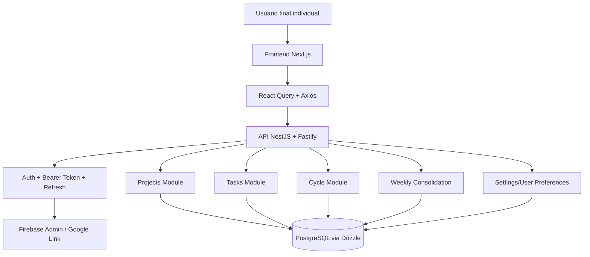
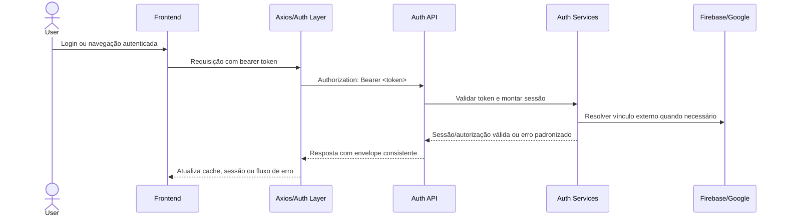
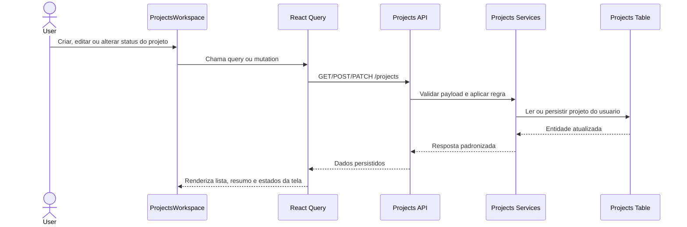
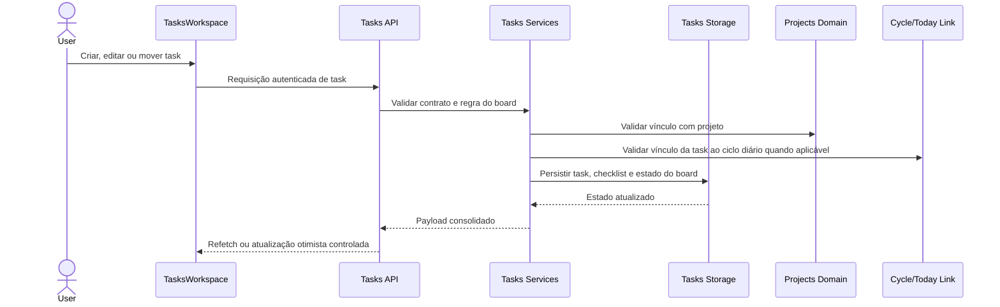
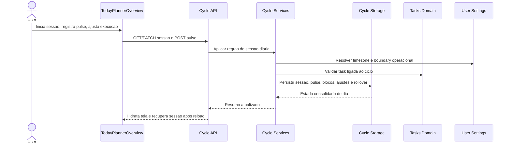
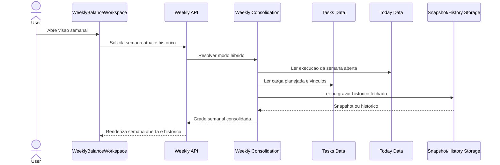
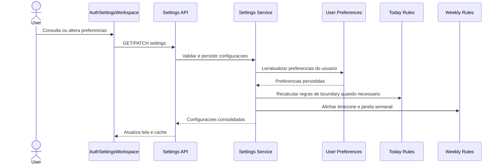
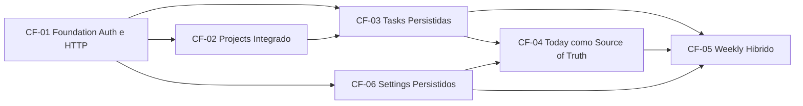

# Core Flow: Integração Backend + Frontend do MVP

> **Baseado em:** [epic.md](./epic.md) | **Data:** 2026-03-22

## Visão Geral da Arquitetura

## Fluxos

### CF-01: Foundation de autenticação e integração HTTP
**Descrição:** Estabiliza a base transversal de autenticação, sessão, tratamento de erro, contratos HTTP e comportamento padrão de cache para todos os domínios integrados.  
**Usuários:** Usuário final individual  
**Pré-condições:** EPIC aprovado; backend e frontend já executando no ambiente local

**Componentes envolvidos:**
- Frontend: `src/lib/axios.ts`, `src/lib/queryClient.ts`, `modules/auth/services/authService.ts`, `modules/auth/queries/*`, `useAuthStore`
- API: `auth.controller.ts`, `get-auth-session.use-case.ts`, `login-user.use-case.ts`
- Service: `AuthFinderService`, `AuthWriterService`
- DB: usuários, contas vinculadas, metadados de sessão/autorização quando aplicável
- Integrações: Firebase Admin, vínculo Google

**Diagrama:**

**Edge cases & regras de negócio:**
- `401` deve acionar fluxo previsível de renovação ou logout conforme a política final de refresh token.
- `403`, `404` e `500` precisam de tratamento consistente no frontend, sem mensagens ad hoc por domínio.
- O envelope de erro e resposta deve ser uniforme o suficiente para reduzir mapeamento manual entre backend e frontend.
- O vínculo Google em Settings ainda depende de decisão final sobre desvinculação no MVP.

**Dependências:** —

---

### CF-02: Projects como primeiro domínio persistido de ponta a ponta
**Descrição:** Consolida Projects como domínio já existente no backend e estabelece o padrão definitivo de integração frontend-backend para leituras, mutations, invalidação e estados de UI.  
**Usuários:** Usuário final individual  
**Pré-condições:** CF-01 estabilizado

**Componentes envolvidos:**
- Frontend: `ProjectsWorkspace`, `projectsService.ts`, `projectKeys.ts`, `useProjectsQuery`, mutations de create, update e toggle
- API: `ProjectsController`
- Service: `ProjectsFinderService`, `ProjectsWriterService`
- DB: tabela `projects`
- Integrações: autenticação bearer e cache React Query

**Diagrama:**

**Edge cases & regras de negócio:**
- O frontend já possui integração parcial de Projects; o fluxo precisa eliminar o fallback principal em mock local.
- Create, update e toggle de status devem invalidar ou atualizar cache sem divergência visual.
- Percentual, tipo do projeto e status precisam permanecer consistentes entre backend e frontend.
- Loading, empty, error e refetch são obrigatórios na tela final.

**Dependências:** CF-01

---

### CF-03: Tasks persistidas com board e vínculo ao ciclo diário
**Descrição:** Cria o domínio Tasks no backend e migra o board do frontend para persistência real, cobrindo CRUD, checklist, vínculo com projeto e vínculo da task a um ciclo diário concreto.  
**Usuários:** Usuário final individual  
**Pré-condições:** CF-01 e CF-02

**Componentes envolvidos:**
- Frontend: `TasksWorkspace`, `TaskForm`, `TasksList`, `TaskFilters`, `tasksService.ts`, query hooks e mutations
- API: novo `TasksController`
- Service: novos serviços de leitura e escrita de tasks
- DB: nova tabela `tasks` e estruturas auxiliares necessárias para checklist e vínculo ao ciclo
- Integrações: Projects, Today, React Query

**Diagrama:**

**Edge cases & regras de negócio:**
- O board terá colunas fixas e ordem fixa, então a persistência não inclui customização estrutural do workflow.
- Checklist faz parte do escopo do MVP e não pode ser perdido no mapeamento do contrato.
- O vínculo da task com o ciclo diário concreto precisa ser explícito no modelo de dados para suportar Today e Weekly.
- Arquivamento, mudança de status e movimentação de task devem preservar consistência com a tela e com as métricas derivadas.

**Dependências:** CF-01, CF-02

---

### CF-04: Today como source of truth operacional do dia
**Descrição:** Persiste o domínio Today no backend como fonte de verdade do estado diário, incluindo sessão, projeto ativo, blocos de tempo, pulses, regularizações, fechamento do dia e rollover.  
**Usuários:** Usuário final individual  
**Pré-condições:** CF-01, CF-02 e base mínima de CF-03

**Componentes envolvidos:**
- Frontend: `TodayPlannerOverview`, `TodayCycleForm`, `CycleTasksBoard`, `ExecutionAdjuster`, `useActivityPulse`, `todayService.ts`, queries e mutations
- API: extensão do `CycleController` ou novos endpoints do domínio `cycle`
- Service: serviços e use cases de sessão diária, pulse e fechamento
- DB: `cycleSessions`, `pulseRecords`, persistência de blocos/ajustes/rollover e vínculo com tasks
- Integrações: Tasks, Projects, Settings/timezone

**Diagrama:**

**Edge cases & regras de negócio:**
- O domínio precisa recuperar a sessão corretamente após refresh e troca de dispositivo.
- `pulse` requer idempotência mínima para evitar duplicidade em janelas curtas.
- Timezone e boundary do dia devem seguir configuração persistida do usuário.
- Regularizações ainda têm pergunta em aberto sobre necessidade de trilha auditável mínima.
- Fechamento do dia e rollover não podem perder vínculo com tasks e contexto do projeto ativo.

**Dependências:** CF-01, CF-02, CF-03

---

### CF-05: Weekly híbrido com semana aberta e histórico fechado
**Descrição:** Conecta Weekly a dados persistidos, combinando cálculo sob demanda para semana aberta com histórico confiável para semanas fechadas.  
**Usuários:** Usuário final individual  
**Pré-condições:** CF-01, CF-03, CF-04

**Componentes envolvidos:**
- Frontend: `WeeklyBalanceWorkspace`, `weeklyService.ts`, `useWeeklySnapshotQuery`, `useWeeklyHistoryQuery`
- API: novos contratos `GET /weekly/snapshots` e `GET /weekly/history`
- Service: consolidador semanal por projeto e por dia
- DB: storage de snapshots/histórico ou materialização equivalente
- Integrações: Tasks, Today, Projects, Settings/timezone

**Diagrama:**

**Edge cases & regras de negócio:**
- A origem final da semana fechada ainda precisa ser confirmada entre snapshot materializado ou forma equivalente persistida.
- A grade semanal precisa distinguir claramente dado provisório versus dado fechado.
- Weekly não pode calcular métricas conflitantes com Today e Tasks.
- A semana atual pode continuar parcialmente derivada enquanto houver sessão aberta.

**Dependências:** CF-01, CF-03, CF-04

---

### CF-06: Settings persistidos com impacto transversal em tempo e sessão
**Descrição:** Persiste as preferências operacionais do usuário e conecta Settings ao backend, incluindo timezone, notificações, horário de revisão, hora inicial do ciclo e vínculo Google.  
**Usuários:** Usuário final individual  
**Pré-condições:** CF-01

**Componentes envolvidos:**
- Frontend: `AuthSettingsWorkspace`, `settingsService.ts`, `settingsKeys.ts`, hooks de leitura e atualização
- API: `GET/PATCH /users/settings` ou extensão de `auth/session`
- Service: leitura/escrita de preferências do usuário
- DB: schema de preferências ou extensão da entidade de usuário
- Integrações: Auth, Today, Weekly, Google link

**Diagrama:**

**Edge cases & regras de negócio:**
- Timezone precisa impactar corretamente Today e Weekly sem criar leituras incoerentes.
- O escopo do vínculo Google ainda depende da decisão de incluir ou não desvinculação já no MVP.
- Configurações podem ficar em cache separado ou junto da sessão autenticada, mas o comportamento precisa ser previsível.
- Alterar preferências temporais exige recalcular boundary e recuperação de sessão onde aplicável.

**Dependências:** CF-01

---

## Mapa de Dependências

## Ordem de Implementação Sugerida

| Ordem | Fluxo | Motivo |
|-------|-------|--------|
| 1 | CF-01 | Base transversal de autenticação, erros, Axios e cache para todos os domínios |
| 2 | CF-02 | Primeiro domínio integrado real, menor risco relativo e base de padrão para o frontend |
| 3 | CF-03 | Tasks é dependente de Projects e passa a sustentar Today e Weekly |
| 4 | CF-06 | Settings precisa estabilizar timezone e preferências operacionais antes do comportamento completo de Today e Weekly |
| 5 | CF-04 | Today depende de Tasks e Settings para persistir sessão diária com regras completas |
| 6 | CF-05 | Weekly deve fechar por último, porque depende da consistência entre Tasks, Today e Settings |

---
*Gerado por PLANNER — Fase 2/3*