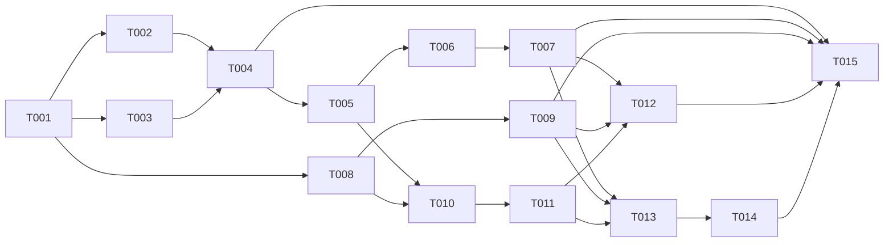

# Tickets — Integração Backend + Frontend do MVP

## Resumo
- **Total:** 15 tickets | **Estimativa total:** 56 pontos
- **Epic:** [../epic.md](../epic.md)
- **Core Flow:** [../core-flow.md](../core-flow.md)
- **Checkpoint atual:** T013 concluído em 2026-03-23
- **Próximo ticket sugerido:** T014 — Integrar Weekly no frontend com dados híbridos

## Por Fluxo

### CF-01: Foundation de autenticação e integração HTTP

| ID | Título | Tipo | Tamanho | Depende de | Status |
|----|--------|------|---------|------------|--------|
| T001 | Consolidar contrato auth e envelope HTTP | API | M | — | Concluído |
| T002 | Ajustar camada HTTP e cache do frontend | INT | M | T001 | Concluído |

### CF-02: Projects como primeiro domínio persistido de ponta a ponta

| ID | Título | Tipo | Tamanho | Depende de | Status |
|----|--------|------|---------|------------|--------|
| T003 | Revisar contratos backend de Projects | API | S | T001 | Concluído |
| T004 | Migrar Projects para integração completa | FEAT | M | T002, T003 | Concluído |

### CF-03: Tasks persistidas com board e vínculo ao ciclo diário

| ID | Título | Tipo | Tamanho | Depende de | Status |
|----|--------|------|---------|------------|--------|
| T005 | Modelar persistência de Tasks e vínculo com ciclo | DATA | L | T001, T004 | Concluído |
| T006 | Implementar API e regras de Tasks | API | L | T005 | Concluído |
| T007 | Integrar Tasks no frontend com board persistido | FEAT | L | T002, T006 | Concluído |

### CF-04: Today como source of truth operacional do dia

| ID | Título | Tipo | Tamanho | Depende de | Status |
|----|--------|------|---------|------------|--------|
| T010 | Fechar contrato canônico de Today | RFCT | M | T005, T008 | Concluído |
| T011 | Implementar backend de Today: sessão, pulse e rollover | API | L | T010 | Concluído |
| T012 | Integrar Today no frontend com source of truth do backend | FEAT | L | T007, T009, T011 | Concluído |

### CF-05: Weekly híbrido com semana aberta e histórico fechado

| ID | Título | Tipo | Tamanho | Depende de | Status |
|----|--------|------|---------|------------|--------|
| T013 | Definir contratos híbridos de Weekly | API | M | T007, T009, T011 | Concluído |
| T014 | Integrar Weekly no frontend com dados híbridos | FEAT | M | T013 | Backlog |

### CF-06: Settings persistidos com impacto transversal em tempo e sessão

| ID | Título | Tipo | Tamanho | Depende de | Status |
|----|--------|------|---------|------------|--------|
| T008 | Persistir Settings e contratos de preferências | API | M | T001 | Concluído |
| T009 | Integrar Settings no frontend e propagar timezone | FEAT | M | T002, T008 | Concluído |

### Fechamento do Epic

| ID | Título | Tipo | Tamanho | Depende de | Status |
|----|--------|------|---------|------------|--------|
| T015 | Validar fluxo ponta a ponta e cobertura de regressão | TEST | L | T004, T007, T009, T012, T014 | Backlog |

## Ordem de Implementação

