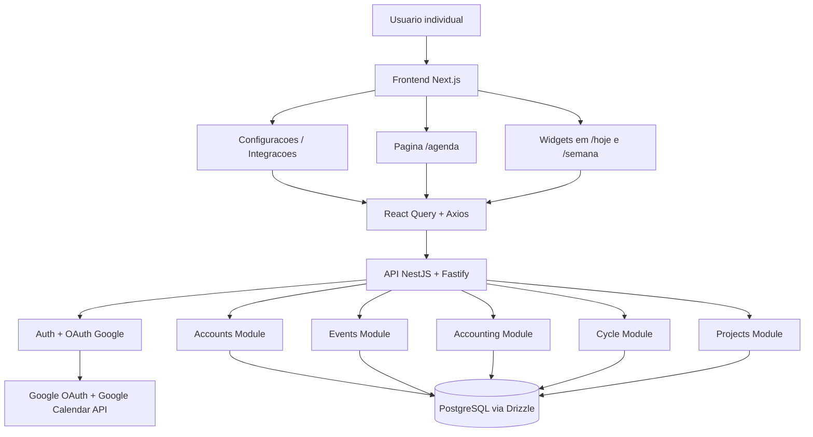
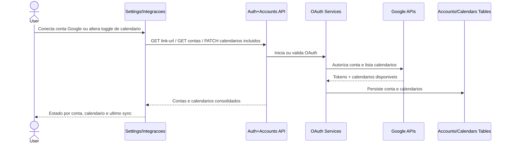
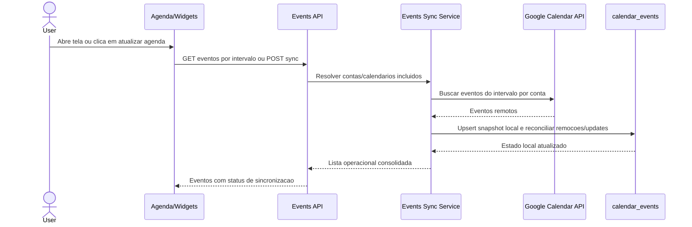
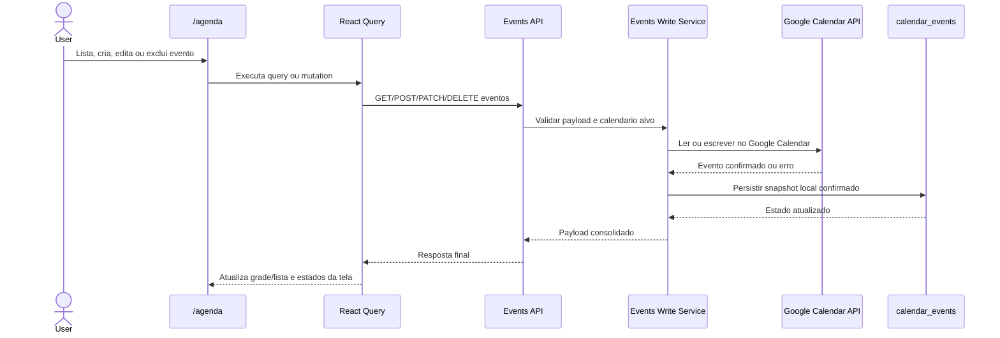
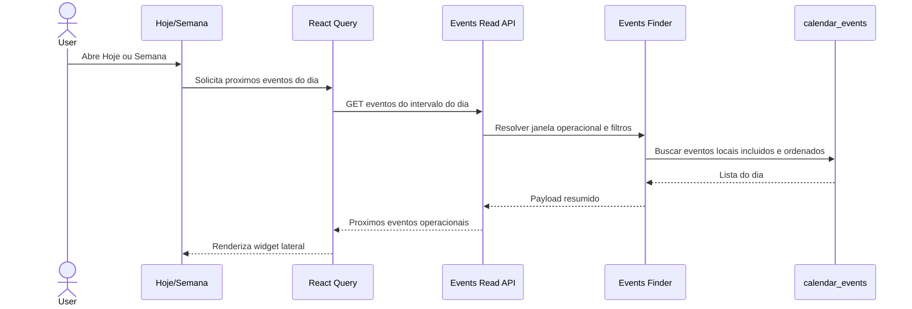
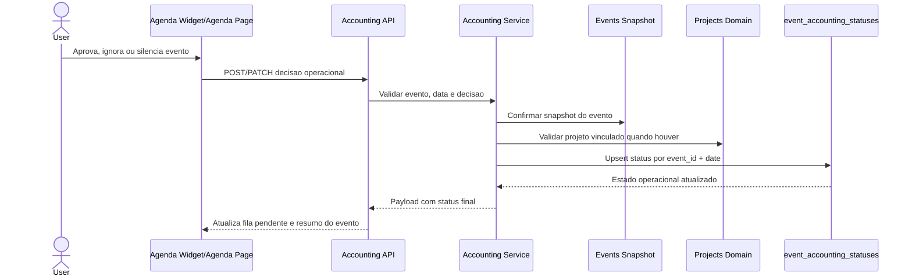
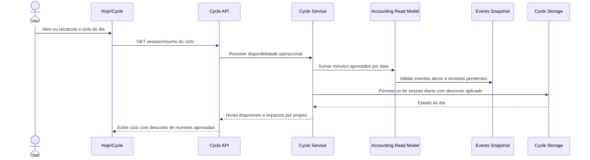
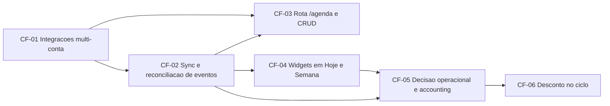

# Core Flow: Modo Agenda

> **Baseado em:** [epic.md](./epic.md) | **Data:** 2026-03-22

## Visao Geral da Arquitetura

## Fluxos

### CF-01: Conexao Google multi-conta e selecao operacional de calendarios
**Descricao:** Consolida a fundacao de integracoes para agenda, reaproveitando o vinculo Google existente e expandindo Configuracoes para gestao multi-conta e toggle por calendario.  
**Usuarios:** Usuario individual do WorkCycle; usuario com multiplas contas Google  
**Pre-condicoes:** `epic.md` aprovado; fluxo atual de auth e listagem basica de contas Google disponivel

**Componentes envolvidos:**
- Frontend: rota `/configuracoes`, `AuthSettingsWorkspace`, novos componentes de Integracoes/Calendarios, `authService`, query hooks de contas e calendarios
- API: endpoints de OAuth/link existentes em `auth`, leitura e atualizacao de contas/calendarios em `accounts`
- Service: resolucao de contas conectadas, refresh de token quando necessario, atualizacao de `google_calendars.is_included`
- DB: `google_accounts`, `google_calendars`
- Integracoes: Google OAuth 2.0, Google Calendar API

**Diagrama:**

**Edge cases & regras de negocio:**
- Cada conta Google deve falhar isoladamente, sem bloquear as demais.
- Calendarios com mesmo nome em contas distintas precisam de identificacao clara por conta.
- Desativar um calendario via toggle deve remover sua influencia de widgets, `/agenda` operacional e contabilizacao sem apagar historico local necessario.
- Token expirado precisa virar estado degradado recuperavel, com CTA de reconexao por conta.

**Dependencias:** —

---

### CF-02: Snapshot local de eventos e reconciliacao com Google Calendar
**Descricao:** Expande o modulo `events` para sincronizar eventos por intervalo, manter snapshot local consistente e reconciliar mudancas remotas sem depender de webhooks.  
**Usuarios:** Usuario individual do WorkCycle; usuario com multiplas contas Google  
**Pre-condicoes:** CF-01 estabilizado

**Componentes envolvidos:**
- Frontend: actions de refresh manual e leitura por intervalo em `/agenda`, `/hoje` e `/semana`
- API: novos contratos de listagem por intervalo, refresh sob demanda e detalhamento de eventos
- Service: sincronizacao incremental, reconciliacao remota, normalizacao de recorrencia e merge por conta/calendario
- Repository: expansao de `events.repository.ts`
- DB: `calendar_events`, `google_calendars`
- Integracoes: Google Calendar API

**Diagrama:**

**Edge cases & regras de negocio:**
- Sem webhooks, a reconciliacao deve ser idempotente e orientada por janela temporal de leitura/sync manual.
- Eventos removidos remotamente precisam ser marcados/reconciliados sem quebrar historico de decisoes operacionais ja tomadas.
- Recorrencias exigem diferenciar serie e ocorrencia para evitar duplicidade ou silenciamento incorreto.
- Eventos all-day nao podem deslocar o bucket operacional do dia por erro de timezone.
- Falha parcial de sync em uma conta ou calendario deve retornar degradacao localizada e ainda entregar os demais resultados.

**Dependencias:** CF-01

---

### CF-03: Rota /agenda com leitura por intervalo e CRUD write-through
**Descricao:** Entrega a experiencia principal do modulo Agenda no frontend, com navegacao dedicada, visao por intervalo e CRUD de eventos refletido no Google Calendar antes de confirmar sucesso.  
**Usuarios:** Usuario individual do WorkCycle; usuario com multiplas contas Google  
**Pre-condicoes:** CF-01 e CF-02

**Componentes envolvidos:**
- Frontend: nova rota `/agenda`, `modules/agenda/`, service, query keys, queries, mutations, formularios e componentes de listagem/edicao
- API: `GET /events`, `POST /events`, `PATCH /events/:id`, `DELETE /events/:id`, endpoints auxiliares de calendario selecionado e refresh quando aplicavel
- Service: validacao de calendario alvo, proxy write-through para Google, persistencia local apos confirmacao remota
- DB: `calendar_events`, `google_calendars`
- Integracoes: Google Calendar API

**Diagrama:**

**Edge cases & regras de negocio:**
- O sucesso visual do CRUD so pode acontecer depois da confirmacao remota do Google.
- Criacao e edicao precisam respeitar apenas calendarios incluidos e acessiveis da conta correspondente.
- Mover evento entre calendarios e um ponto aberto do Epic; o fluxo deve permitir deixar isso fora do primeiro corte sem quebrar o contrato base.
- `/agenda` precisa cobrir loading, empty, error, stale e refresh manual.
- O modulo deve funcionar mesmo quando apenas parte das contas estiver disponivel.

**Dependencias:** CF-01, CF-02

---

### CF-04: Widgets de proximos eventos em /hoje e /semana
**Descricao:** Leva a agenda operacional para o contexto de trabalho existente, exibindo proximos eventos do dia em widgets laterais minimais compartilhando a mesma fonte de dados da agenda.  
**Usuarios:** Usuario individual do WorkCycle  
**Pre-condicoes:** CF-02; leitura de eventos consolidada

**Componentes envolvidos:**
- Frontend: paginas `/hoje` e `/semana`, novo widget de agenda, estado de loading/erro/vazio, query compartilhada de proximos eventos
- API: leitura resumida de eventos do dia ou reaproveitamento de listagem por intervalo com filtro no frontend
- Service: agregacao do dia operacional, ordenacao por horario e filtro por calendarios incluidos
- DB: `calendar_events`, `google_calendars`
- Integracoes: mesmas de events read model

**Diagrama:**

**Edge cases & regras de negocio:**
- O widget nao deve introduzir segunda fonte de verdade; precisa consumir o mesmo read model da agenda.
- Eventos silenciados ou de calendarios excluidos nao podem aparecer.
- Falha parcial de sync deve ser visivel sem derrubar toda a lateral.
- Quando nao houver eventos, a tela deve continuar focada no ciclo sem ruido visual.

**Dependencias:** CF-02

---

### CF-05: Decisao operacional sobre eventos e fila de contabilizacao
**Descricao:** Expande o dominio `accounting` para transformar eventos sincronizados em decisoes operacionais por data, permitindo aprovar, ignorar ou silenciar recorrencias irrelevantes.  
**Usuarios:** Usuario orientado a projetos; usuario individual do WorkCycle  
**Pre-condicoes:** CF-02 e CF-04

**Componentes envolvidos:**
- Frontend: acoes de aprovar, ignorar, silenciar e vincular projeto no widget e/ou em `/agenda`
- API: endpoints de leitura e decisao sobre `event_accounting_statuses`
- Service: resolucao de status por `event_id + date`, regras de silenciamento, aprovacao com minutos e projeto opcional
- DB: `event_accounting_statuses`, `calendar_events`
- Integracoes: `projects` para vinculo opcional de reuniao aprovada

**Diagrama:**

**Edge cases & regras de negocio:**
- `approved`, `ignored` e `silenced` precisam ser idempotentes por evento e data.
- Silenciar recorrencia deve impedir ruido futuro sem apagar historico resolvido das ocorrencias passadas.
- O vinculo a projeto deve ser opcional na aprovacao inicial, mas consistente quando informado.
- Evento alterado ou removido apos aprovacao precisa gerar estado de revisao na proxima reconciliacao.
- Decisoes nao podem ser acopladas ao horario atual do usuario de forma a perder contexto apos reload.

**Dependencias:** CF-02, CF-04

---

### CF-06: Desconto de horas aprovadas no ciclo diario
**Descricao:** Integra o resultado de `accounting` ao dominio `cycle`, fazendo com que apenas reunioes aprovadas reduzam a disponibilidade operacional do dia sem tornar o ciclo dono dos eventos.  
**Usuarios:** Usuario orientado a projetos; usuario individual do WorkCycle  
**Pre-condicoes:** CF-05; leitura operacional do dia consolidada; projetos disponiveis

**Componentes envolvidos:**
- Frontend: `/hoje`, possivel resumo de impacto no ciclo, mensagens de revisao quando houver eventos alterados
- API: extensao do dominio `cycle` para retornar horas disponiveis ja abatidas e pendencias relacionadas
- Service: read model de minutos aprovados por data, agregacao por projeto e integracao com sessao diaria
- DB: `event_accounting_statuses`, estruturas do dominio `cycle`
- Integracoes: `projects`, `events`, `accounting`

**Diagrama:**

**Edge cases & regras de negocio:**
- Apenas eventos `approved` podem abater horas; `pending`, `ignored` e `silenced` nao entram no calculo.
- O desconto precisa ser idempotente por `event_id + date` para nao duplicar consumo ao recalcular o ciclo.
- Se um evento aprovado for removido ou tiver duracao alterada, o ciclo precisa refletir revisao ou reconciliacao no proximo carregamento.
- O ciclo continua independente para planejamento manual; agenda entra como ajuste operacional, nao como dono absoluto do dia.
- O resumo por projeto deve considerar apenas reunioes aprovadas com projeto vinculado.

**Dependencias:** CF-05

---

## Mapa de Dependencias

## Ordem de Implementacao Sugerida

| Ordem | Fluxo | Motivo |
|-------|-------|--------|
| 1 | CF-01 | Estabiliza a fundacao multi-conta e a gestao por calendario antes de consumir dados de agenda em qualquer tela |
| 2 | CF-02 | Sem snapshot local e reconciliacao confiavel, nao existe fonte operacional consistente para widgets, agenda ou ciclo |
| 3 | CF-03 | A rota `/agenda` depende da base de leitura e escrita remota ja estabilizada |
| 4 | CF-04 | Widgets de Hoje e Semana passam a reutilizar a fonte operacional consolidada sem criar nova logica paralela |
| 5 | CF-05 | A fila de decisoes operacionais precisa vir depois da leitura de eventos e do contexto visual nas telas |
| 6 | CF-06 | O ciclo deve consumir apenas a camada de accounting ja estabilizada, evitando acoplamento direto com eventos brutos |

## Perguntas em Aberto para a Fase de Tickets

- [ ] O primeiro corte de `/agenda` sera lista cronologica com filtros ou ja precisa incluir view de calendario visual?
- [ ] O silenciamento permanente sera por serie (`recurringEventId`) sempre que existir, com qual fallback para eventos sem chave recorrente consistente?
- [ ] Eventos all-day podem ser aprovados para desconto no ciclo ou ficam apenas como contexto visual no MVP?
- [ ] A revisao de um evento aprovado alterado externamente sera automatica no ciclo ou exposta como pendencia explicita ao usuario?
- [ ] O CRUD inicial precisa permitir troca de calendario de um evento existente entre contas conectadas?

---
*Gerado por PLANNER — Fase 2/3*