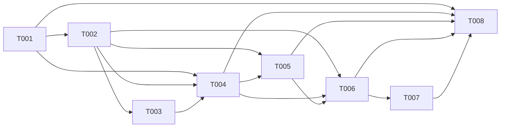

# Tickets - Modo Agenda

## Resumo
- **Total:** 8 tickets | **Estimativa total:** 38 pontos
- **Epic:** [../epic.md](../epic.md)
- **Core Flow:** [../core-flow.md](../core-flow.md)
- **Checkpoint atual:** tickets refinados para execucao, com escopo observavel, contratos minimos, edge cases e nao-goals por unidade de trabalho
- **Proximo ticket sugerido:** T001 - Entregar Integracoes Google multi-conta e toggle por calendario

## Criterios usados na revisao
- juntar tickets que so fazem sentido quando backend e frontend avancam juntos
- remover tickets de definicao de contrato sem entrega funcional independente
- preservar dependencia tecnica real entre `accounts`, `events`, `accounting`, `cycle` e frontend
- manter tamanho maximo em torno de slices executaveis por fluxo, evitando microtickets artificiais
- explicitar ownership de backend e frontend em cada ticket, reduzindo ambiguidade entre rota, modulo, query e endpoint
- transformar criterios de aceite em validacoes objetivas, incluindo estados degradados, idempotencia e recuperacao
- registrar edge cases e nao-goals para evitar expansao fora do escopo aprovado do epic

## Por Fluxo

### CF-01: Conexao Google multi-conta e selecao operacional de calendarios

| ID | Titulo | Tipo | Tamanho | Depende de | Status |
|----|--------|------|---------|------------|--------|
| T001 | Entregar Integracoes Google multi-conta e toggle por calendario | FEAT | L | - | Backlog |

### CF-02: Snapshot local de eventos e reconciliacao com Google Calendar

| ID | Titulo | Tipo | Tamanho | Depende de | Status |
|----|--------|------|---------|------------|--------|
| T002 | Implementar leitura operacional, sync e reconciliacao de eventos | API | L | T001 | Backlog |

### CF-03: Rota /agenda com leitura por intervalo e CRUD write-through

| ID | Titulo | Tipo | Tamanho | Depende de | Status |
|----|--------|------|---------|------------|--------|
| T003 | Implementar CRUD write-through de eventos no backend | API | L | T002 | Backlog |
| T004 | Entregar rota `/agenda` com navegacao, leitura por intervalo e CRUD | FEAT | L | T001, T002, T003 | Backlog |

### CF-04: Widgets de proximos eventos em /hoje e /semana

| ID | Titulo | Tipo | Tamanho | Depende de | Status |
|----|--------|------|---------|------------|--------|
| T005 | Exibir widget lateral de agenda em Hoje e Semana | FEAT | M | T002, T004 | Backlog |

### CF-05: Decisao operacional sobre eventos e fila de contabilizacao

| ID | Titulo | Tipo | Tamanho | Depende de | Status |
|----|--------|------|---------|------------|--------|
| T006 | Entregar accounting operacional de eventos ponta a ponta | FEAT | L | T002, T004, T005 | Backlog |

### CF-06: Desconto de horas aprovadas no ciclo diario

| ID | Titulo | Tipo | Tamanho | Depende de | Status |
|----|--------|------|---------|------------|--------|
| T007 | Integrar impacto aprovado da agenda ao ciclo ponta a ponta | FEAT | L | T006 | Backlog |

### Fechamento do Epic

| ID | Titulo | Tipo | Tamanho | Depende de | Status |
|----|--------|------|---------|------------|--------|
| T008 | Validar fluxo ponta a ponta e cobertura de regressao do Modo Agenda | TEST | L | T001, T004, T005, T006, T007 | Backlog |

## Ordem de Implementacao

## Consolidacoes realizadas

- T001 antigo + T002 antigo viraram um unico slice vertical de Integracoes
- T003 antigo foi absorvido por T002 para eliminar ticket de contrato sem entrega funcional
- T006 antigo + T007 antigo viraram um unico ticket da rota `/agenda`
- T009 antigo + T010 antigo viraram um unico ticket de accounting ponta a ponta
- T011 antigo + T012 antigo viraram um unico ticket de impacto no ciclo ponta a ponta

## Motivo da reducao

O plano anterior estava correto em cobertura, mas fragmentado demais para uma feature fortemente encadeada. A nova divisao reduz esperas entre backend e frontend, evita tickets que apenas preparam contrato sem liberar comportamento e deixa cada etapa com um resultado validavel no produto.

## Observacao sobre este pacote refinado

Os IDs, titulos e dependencias aprovados foram preservados. O refinamento abaixo detalha melhor contratos esperados, limites de modulo, arquivos provaveis, edge cases obrigatorios e criterios de aceite testaveis, sem criar novo epic, novo core flow ou novas capacidades fora do escopo aprovado.

---
*Gerado por PLANNER - Fase 3/3 | Epic: Modo Agenda*
