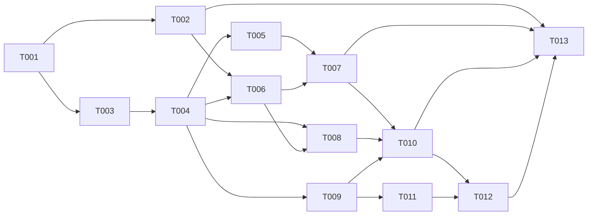

# Tickets - Modo Agenda

## Resumo
- **Total:** 13 tickets | **Estimativa total:** 49 pontos
- **Epic:** [../epic.md](../epic.md)
- **Core Flow:** [../core-flow.md](../core-flow.md)
- **Checkpoint atual:** nenhum ticket iniciado
- **Proximo ticket sugerido:** T001 - Expandir contratos de contas Google e calendarios

## Por Fluxo

### CF-01: Conexao Google multi-conta e selecao operacional de calendarios

| ID | Titulo | Tipo | Tamanho | Depende de | Status |
|----|--------|------|---------|------------|--------|
| T001 | Expandir contratos de contas Google e calendarios | API | M | - | Backlog |
| T002 | Integrar Settings/Integracoes com multi-conta e toggle por calendario | FEAT | M | T001 | Backlog |

### CF-02: Snapshot local de eventos e reconciliacao com Google Calendar

| ID | Titulo | Tipo | Tamanho | Depende de | Status |
|----|--------|------|---------|------------|--------|
| T003 | Definir contrato canonico de sync e leitura operacional de eventos | RFCT | M | T001 | Backlog |
| T004 | Implementar sync, snapshot e reconciliacao de eventos no backend | API | L | T003 | Backlog |

### CF-03: Rota /agenda com leitura por intervalo e CRUD write-through

| ID | Titulo | Tipo | Tamanho | Depende de | Status |
|----|--------|------|---------|------------|--------|
| T005 | Implementar CRUD write-through de eventos no backend | API | L | T004 | Backlog |
| T006 | Criar foundation frontend do modulo Agenda e navegacao | FEAT | M | T002, T004 | Backlog |
| T007 | Implementar leitura por intervalo e CRUD na rota /agenda | FEAT | L | T005, T006 | Backlog |

### CF-04: Widgets de proximos eventos em /hoje e /semana

| ID | Titulo | Tipo | Tamanho | Depende de | Status |
|----|--------|------|---------|------------|--------|
| T008 | Exibir widget lateral de agenda em Hoje e Semana | FEAT | M | T004, T006 | Backlog |

### CF-05: Decisao operacional sobre eventos e fila de contabilizacao

| ID | Titulo | Tipo | Tamanho | Depende de | Status |
|----|--------|------|---------|------------|--------|
| T009 | Implementar API e regras de accounting para eventos operacionais | API | L | T004 | Backlog |
| T010 | Integrar aprovacao, ignorar e silenciar no frontend da agenda | FEAT | M | T007, T008, T009 | Backlog |

### CF-06: Desconto de horas aprovadas no ciclo diario

| ID | Titulo | Tipo | Tamanho | Depende de | Status |
|----|--------|------|---------|------------|--------|
| T011 | Integrar minutos aprovados ao dominio Cycle no backend | API | M | T009 | Backlog |
| T012 | Integrar impacto da agenda no ciclo do frontend | FEAT | M | T010, T011 | Backlog |

### Fechamento do Epic

| ID | Titulo | Tipo | Tamanho | Depende de | Status |
|----|--------|------|---------|------------|--------|
| T013 | Validar fluxo ponta a ponta e cobertura de regressao do Modo Agenda | TEST | L | T002, T007, T010, T012 | Backlog |

## Ordem de Implementacao

---
*Gerado por PLANNER - Fase 3/3 | Epic: Modo Agenda*
