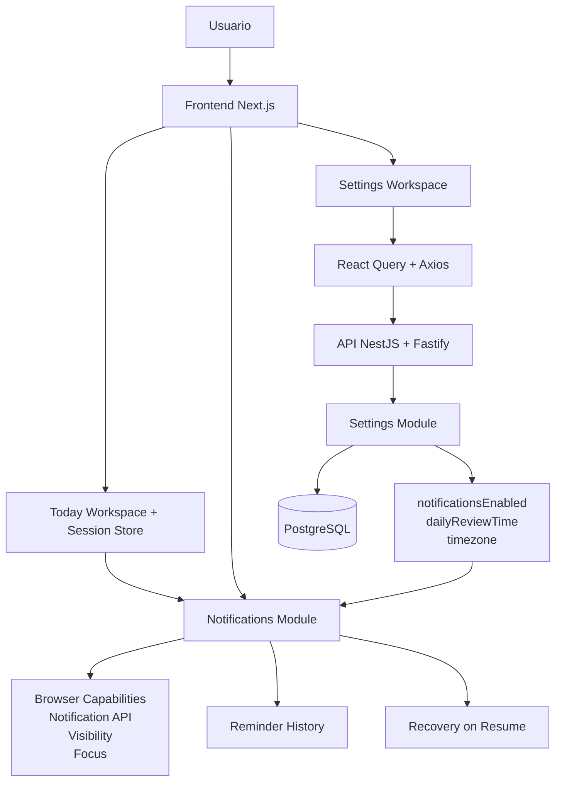
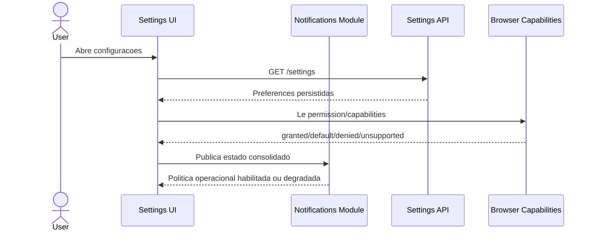
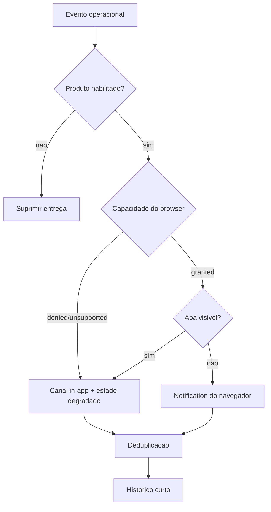
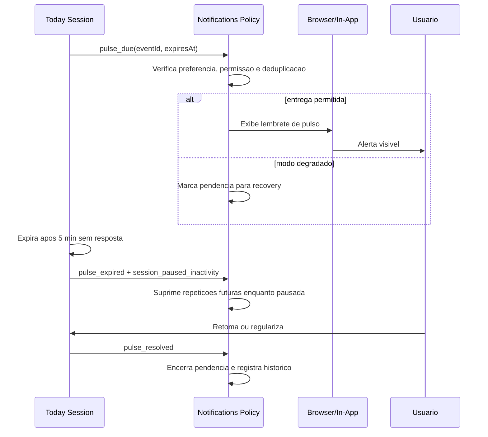
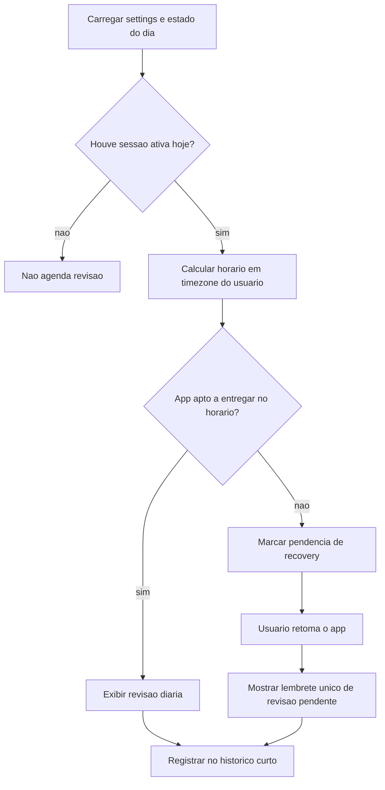
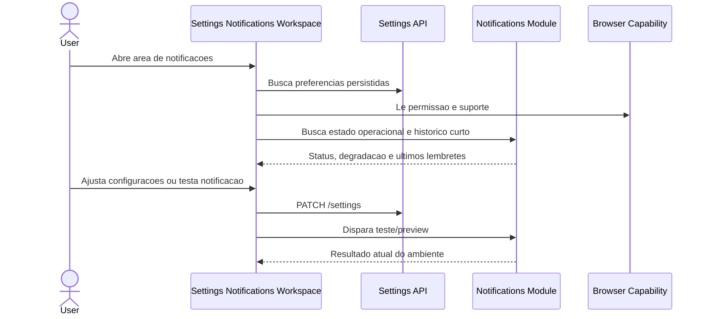
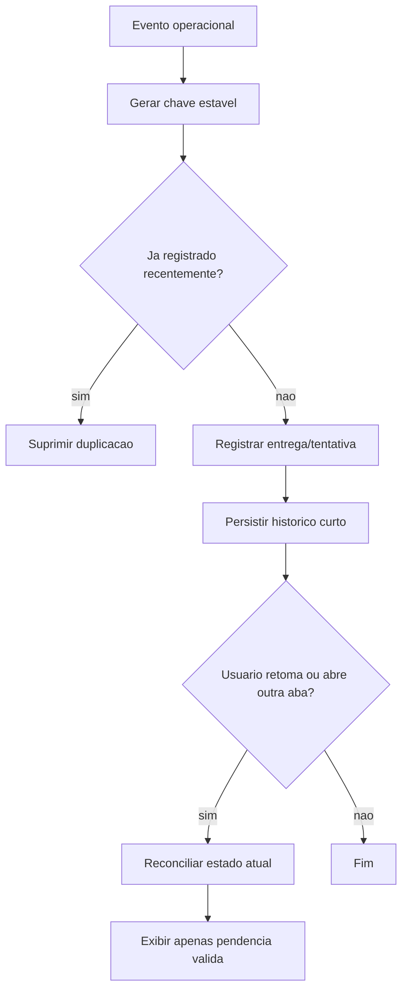

# Core Flow: Notificacoes Operacionais do WorkCycle

> **Baseado em:** [epic.md](./epic.md) | **Data:** 2026-03-22

## Visao Geral da Arquitetura

## Fluxos

### CF-01: Fundacao de preferencias e capacidades de notificacao
**Descricao:** Separa preferencias persistidas do produto e capacidades volateis do navegador para que a politica de notificacoes opere sem estado inconsistente.
**Usuarios:** Usuario individual do WorkCycle; usuario em navegador/PWA no Linux
**Pre-condicoes:** Epic aprovado; Settings backend existente

**Componentes envolvidos:**
- Backend: `SettingsController`, `SettingsFinderService`, `SettingsWriterService`, schema `user_settings`
- Frontend: modulo de Settings, service/query de settings, modulo de Notifications
- Browser: `Notification.permission`, visibilidade e foco da pagina

**Diagrama:**

**Edge cases e regras de negocio:**
- `notificationsEnabled` e permissao do navegador sao estados distintos.
- `timezone` e a referencia canonica para agendamento de revisao diaria.
- Ambiente sem suporte a Notification API deve cair para in-app + estado degradado.

**Dependencias:** -

---

### CF-02: Politica de entrega, permissao e estado degradado
**Descricao:** Cria a camada central de delivery policy no frontend para decidir entre notificacao in-app, notificacao do navegador, supressao ou recovery.
**Usuarios:** Usuario que quer entender se o produto vai conseguir alertar e validar isso com teste operacional
**Pre-condicoes:** CF-01

**Componentes envolvidos:**
- Frontend: modulo `notifications`, store/engine de entrega, UI de status degradado em Settings
- Browser: `Notification`, foco e visibilidade
- Today: emissor de eventos operacionais
- Settings: origem das preferencias persistidas

**Diagrama:**

**Edge cases e regras de negocio:**
- O produto nao promete entrega garantida.
- Toda tentativa de entrega passa por deduplicacao e supressao.
- A acao de teste valida o estado atual do ambiente, nao uma garantia futura.

**Dependencias:** CF-01

---

### CF-03: Ciclo de notificacao do pulso operacional
**Descricao:** Integra o pulso do Today a camada de Notifications sem duplicar responsabilidade de estado de sessao.
**Usuarios:** Usuario com sessao em andamento e usuario que perde foco da aba
**Pre-condicoes:** CF-02; contrato atual do Today preservado

**Componentes envolvidos:**
- Today: `useActivityPulse`, `useWorkspaceStore`
- Notifications: politica de disparo, deduplicacao e recovery
- UI: avisos in-app, historico curto e regularizacao

**Diagrama:**

**Edge cases e regras de negocio:**
- `paused_inactivity` nao pode gerar repeticao sonora ou re-alerta agressivo.
- Clique em alerta stale nao pode reabrir contexto resolvido como se ainda estivesse pendente.
- Reload entre disparo e expiracao nao pode duplicar lembretes.

**Dependencias:** CF-02

---

### CF-04: Revisao diaria e recovery na retomada
**Descricao:** Agenda e reconcilia a revisao diaria respeitando timezone, `dailyReviewTime` e a regra de so notificar em dias com sessao ativa.
**Usuarios:** Usuario que trabalhou no dia e precisa fechar o ciclo
**Pre-condicoes:** CF-01 e CF-02; Today precisa identificar dia com sessao ativa

**Componentes envolvidos:**
- Settings: `dailyReviewTime`, `timezone`
- Today: indicador de sessao iniciada no dia, close-day review, boundary operacional
- Notifications: scheduler client-side, recovery on resume, historico curto

**Diagrama:**

**Edge cases e regras de negocio:**
- Mudanca de timezone ou `dailyReviewTime` reage nos proximos agendamentos, nao no passado.
- Revisao perdida com app fechado vira pendencia unica na retomada.
- Dias sem sessao ativa nao disparam revisao.

**Dependencias:** CF-01, CF-02

---

### CF-05: Workspace de Settings para notificacoes operacionais
**Descricao:** Introduz uma area explicita de notificacoes em Settings, desacoplada da area de conta/Google, com configuracao, status, teste, preview e historico curto.
**Usuarios:** Usuario que quer configurar, validar e diagnosticar notificacoes
**Pre-condicoes:** CF-01 e CF-02

**Componentes envolvidos:**
- Frontend: nova secao/workspace de notificacoes em Settings
- Backend: `GET /settings`, `PATCH /settings`
- Notifications module: estado operacional, teste e historico curto

**Diagrama:**

**Edge cases e regras de negocio:**
- A area de conta/Google continua separada das preferencias operacionais.
- O historico do MVP e curto e explicativo, nao um inbox completo.
- A UI deve deixar explicito quando o browser bloqueia ou nao suporta notificacoes.

**Dependencias:** CF-01, CF-02

---

### CF-06: Historico curto, reload e reconciliacao multiaba
**Descricao:** Mantem historico curto persistido e estrategia minima de reconciliacao para evitar duplicacoes apos reload, retomada ou multiplas abas.
**Usuarios:** Usuario que recarrega a pagina, alterna abas ou precisa entender lembretes recentes
**Pre-condicoes:** CF-02, CF-03, CF-04, CF-05

**Componentes envolvidos:**
- Notifications module
- Storage local persistido no frontend
- Identificadores de evento operacional
- Hooks de resume/visibility/focus
- UI de historico curto em Settings

**Diagrama:**

**Edge cases e regras de negocio:**
- Multiaba prioriza evitar duplicacao, nao sincronizacao perfeita em tempo real.
- Storage corrompido ou indisponivel deve falhar com seguranca.
- Eventos antigos nao podem reabrir contexto stale.

**Dependencias:** CF-02, CF-03, CF-04, CF-05

---
*Gerado por PLANNER — Fase 2/3*