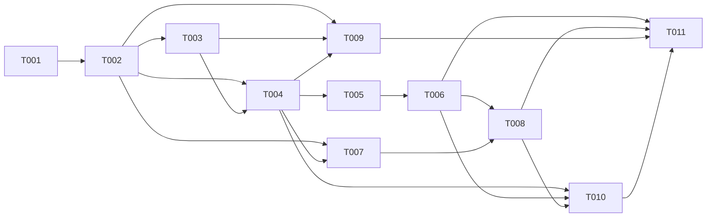

# Tickets — Notificacoes Operacionais do WorkCycle

## Resumo
- **Total:** 11 tickets | **Estimativa total:** 36 pontos
- **Epic:** [../epic.md](../epic.md)
- **Core Flow:** [../core-flow.md](../core-flow.md)
- **Dependencias diretas:** 20 relacoes de bloqueio entre tickets

## Por Fluxo

### CF-01: Fundacao de preferencias e capacidades de notificacao

| ID | Titulo | Tipo | Tamanho | Depende de |
|----|--------|------|---------|------------|
| T001 | Reforcar contrato de Settings para notificacoes operacionais | API | S | - |
| T002 | Integrar preferencias operacionais no frontend | FEAT | M | T001 |

### CF-02: Politica de entrega, permissao e estado degradado

| ID | Titulo | Tipo | Tamanho | Depende de |
|----|--------|------|---------|------------|
| T003 | Mapear capacidades do navegador e estado operacional de notificacoes | FEAT | M | T002 |
| T004 | Implementar motor de entrega e deduplicacao de notificacoes | FEAT | L | T002, T003 |

### CF-03: Ciclo de notificacao do pulso operacional

| ID | Titulo | Tipo | Tamanho | Depende de |
|----|--------|------|---------|------------|
| T005 | Emitir eventos operacionais do Today para Notifications | INT | M | T004 |
| T006 | Tratar expiracao de pulso e supressao em pausa por inatividade | FEAT | M | T005 |

### CF-04: Revisao diaria e recovery na retomada

| ID | Titulo | Tipo | Tamanho | Depende de |
|----|--------|------|---------|------------|
| T007 | Agendar revisao diaria por timezone e sessao ativa | FEAT | M | T002, T004 |
| T008 | Recuperar lembretes pendentes na retomada do app | FEAT | M | T006, T007 |

### CF-05: Workspace de Settings para notificacoes operacionais

| ID | Titulo | Tipo | Tamanho | Depende de |
|----|--------|------|---------|------------|
| T009 | Criar area de notificacoes em Settings com teste e preview | FEAT | M | T002, T003, T004 |

### CF-06: Historico curto, reload e reconciliacao multiaba

| ID | Titulo | Tipo | Tamanho | Depende de |
|----|--------|------|---------|------------|
| T010 | Persistir historico curto e reconciliar reload e multiaba | FEAT | M | T004, T006, T008 |

### Fechamento transversal

| ID | Titulo | Tipo | Tamanho | Depende de |
|----|--------|------|---------|------------|
| T011 | Validar regressao ponta a ponta de notificacoes operacionais | TEST | L | T006, T008, T009, T010 |

## Ordem de Implementacao

## Leitura de Execucao

- O caminho critico e `T001 -> T002 -> T003 -> T004 -> T005 -> T006 -> T008 -> T010 -> T011`.
- `T007` pode rodar em paralelo com `T005/T006` assim que `T004` estiver pronto.
- `T009` depende do motor de notificacoes, mas pode ser implementado em paralelo com `T008` depois de `T004`.
- `T004` permanece como L porque concentra um nucleo coeso de dominio, mas o escopo foi mantido sem persistencia, sem multiaba e sem recovery.
- `T011` permanece como L porque fecha apenas cenarios criticos de regressao, nao toda a cobertura atrasada do epic.

---
*Gerado por PLANNER — Fase 3/3 | Epic: Notificacoes Operacionais do WorkCycle*